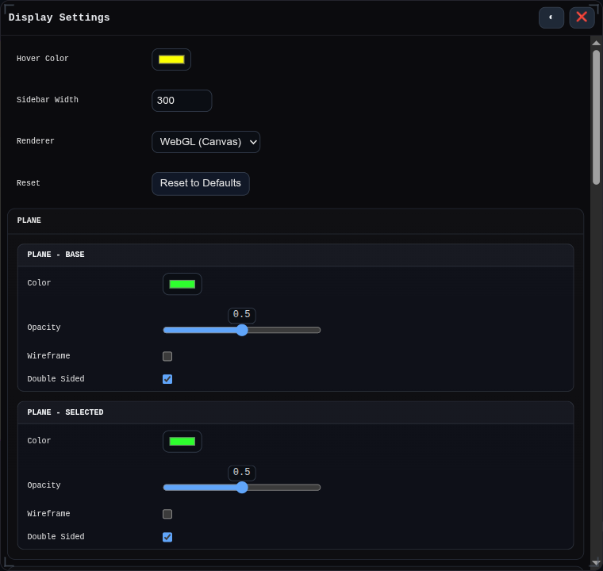

# `⚙` Settings

Opens the Display Settings window.

Settings includes display/material controls and storage configuration, including GitHub repo storage setup.

## Workbench Availability

Global. Available in every workbench.

## Related
- [GitHub Repo Storage](../developer/embedding/github-repo-storage.md)
