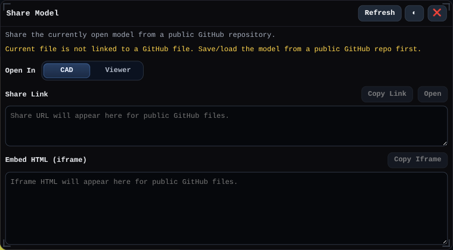

# Share

Opens the Share Model window for generating links and iframe markup for models stored in public GitHub locations.

## Workbench Availability

Available in Modeling, Import, Surfacing, Sheet Metal, Assemblies, Wire Harness, PMI, Simulation, and All.

## Related
- [GitHub Repo Storage](../github-repo-storage.md)
