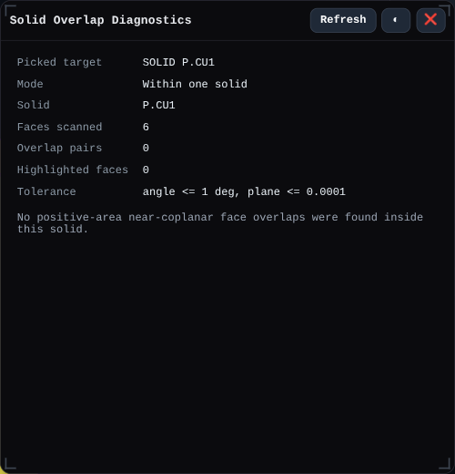

# Solid Overlap Diagnostics

Opens the Solid Overlap Diagnostics window for inspecting overlapping coplanar faces inside one solid or between two selected solids.

## Workbench Availability

Available in All.

## Related
- [Inspector](../inspector.md)
