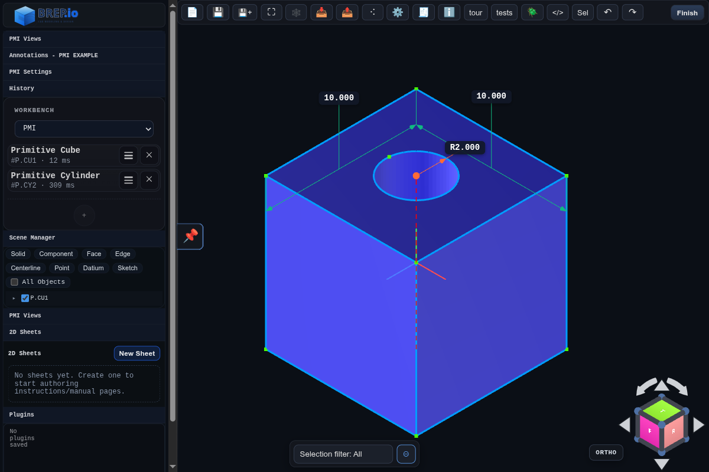

# PMI Workbench

The PMI workbench is for entering and editing PMI views and annotations. It does not add feature-history creation entries to the `+` menu.

Use it after modeling is complete to capture dimensions, callouts, notes, exploded views, inspection data, and view-specific manufacturing intent without altering the underlying solid.

## Tools
- [New](../tools/new.md)
- [Save](../tools/save.md)
- [Save As](../tools/save-as.md)
- [Zoom To Fit](../tools/zoom-to-fit.md)
- [Wireframe](../tools/wireframe.md)
- [Import](../tools/import.md)
- [Export](../tools/export.md)
- [Share](../tools/share.md)
- [Settings](../tools/settings.md)
- [2D Sheet Editor](../tools/sheet-editor.md)
- [About](../tools/about.md)
- [History Test Snippet](../tools/history-test-snippet.md)
- [Script Runner](../tools/script-runner.md)
- [Undo](../tools/undo.md)
- [Redo](../tools/redo.md)
- [Browser Tests](../tools/tests.md) - localhost only
- [Guided Tour](../tools/guided-tour.md) - localhost only
- [Selection State](../tools/selection-state.md) - localhost only

## Features
- No feature-history creation entries are exposed in this workbench.

## PMI Types
- [Linear Dimension](../pmi-annotations/linear-dimension.md)
- [Radial Dimension](../pmi-annotations/radial-dimension.md)
- [Angle Dimension](../pmi-annotations/angle-dimension.md)
- [Leader](../pmi-annotations/leader.md)
- [Note](../pmi-annotations/note.md)
- [Hole Callout](../pmi-annotations/hole-callout.md)
- [Explode Body](../pmi-annotations/explode-body.md)

## Views and Export
- Capture a PMI view from the PMI Views panel to store the current camera, display settings, and annotation list.
- Export Images renders labeled PNGs for saved views by replaying each view and applying its stored annotations.
- 3MF export stores PMI view definitions in `Metadata/featureHistory.json` and attaches generated PNGs under `/views/<view-name>.png`.

## Panels
- [Feature History](../panels/feature-history.md)
- [PMI Views](../panels/pmi-views.md)
- [2D Sheets](../panels/sheets-2d.md)
- [Plugins](../panels/plugins.md)

## Related Docs
- [PMI Annotations Index](../pmi-annotations/index.md)
