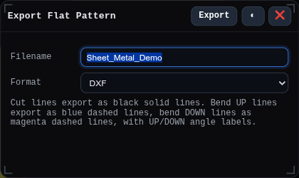
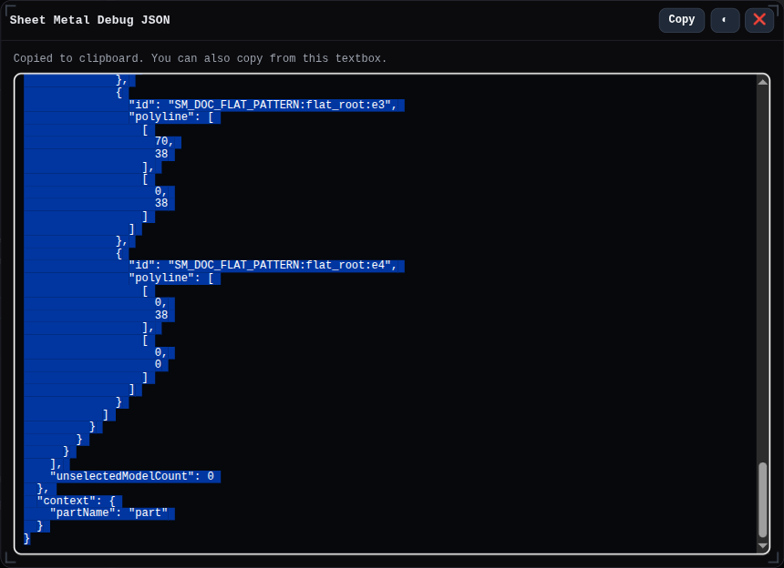

# Sheet Metal Workbench

The Sheet Metal workbench focuses the modeling UI on deterministic sheet-metal creation, editing, flat-pattern export, and sheet-metal diagnostics.

Sheet-metal features build and update a stored `SheetMetalTree`. The folded 3D model and flat 2D representation are regenerated from that tree, and generated faces/edges carry stable `flatId` / `edgeId` metadata so later operations can target the correct sheet edge.

## Tools
- [Sheet Metal Flat Pattern Export](../tools/sheet-metal-flat-export.md)
- [Sheet Metal Debug JSON](../tools/sheet-metal-debug.md) - localhost only

## Features
- Setup geometry: [Datium](../features/datium.md), [Plane](../features/plane.md), [Sketch](../features/sketch.md)
- Base sheet creation: [Sheet Metal Tab](../features/sheet-metal-tab.md), [Sheet Metal Contour Flange](../features/sheet-metal-contour-flange.md)
- Sheet editing: [Sheet Metal Flange](../features/sheet-metal-flange.md), [Sheet Metal Hem](../features/sheet-metal-hem.md), [Sheet Metal Cutout](../features/sheet-metal-cutout.md)
- Shared finishing tools: [Fillet](../features/fillet.md), [Hole](../features/hole.md)

## Context Toolbar
The selection context toolbar is enabled for sheet-metal features in this workbench. It shows feature buttons only when the current selection can seed the required input.

- Selecting a sketch or a sketch profile face shows [Sheet Metal Tab](../features/sheet-metal-tab.md). The created feature uses the owning sketch/profile as its `profile` input.
- Selecting an open sketch, sketch edge, sketch face, model edge, or model face that can define an open path shows [Sheet Metal Contour Flange](../features/sheet-metal-contour-flange.md). Sketch child selections promote to the owning sketch so the contour path uses the whole sketch.
- Selecting a sheet-metal thickness face, cutout wall face, or sheet-metal edge overlay with `flatId` / `edgeId` metadata shows [Sheet Metal Flange](../features/sheet-metal-flange.md). The created feature receives the selected face or edge as its `faces` input.
- Selecting a sketch, sketch profile face, or external solid shows [Sheet Metal Cutout](../features/sheet-metal-cutout.md). Plain faces from the target sheet are not offered as cutout profiles because that would self-reference the sheet body.
- General context actions from shared features, such as [Fillet](../features/fillet.md) and [Hole](../features/hole.md), remain available when their normal selection rules match.

The context toolbar does not show assembly constraints or PMI annotations in Sheet Metal mode.

## Panels
- [Feature History](../panels/feature-history.md)
- [PMI Views](../panels/pmi-views.md)
- [2D Sheets](../panels/sheets-2d.md)
- [Plugins](../panels/plugins.md)

## Workflow Notes
1. Create a base sheet with Tab from a closed sketch/profile, or Contour Flange from an open sketch/path.
2. Select generated sheet-metal side faces or edge overlays to add Flange or Hem features.
3. Add Cutout features from sketches, faces, or external solid tools when material needs to be removed.
4. Use the PMI Views and 2D Sheets panels when the model needs manufacturing views or sheet documentation.
5. Use Flat Pattern Export for DXF/SVG output after the tree evaluates successfully.

## Diagnostics

The Sheet Metal Debug JSON window packages the current feature history and sheet-metal tree so a failing flat pattern or geometry case can be reproduced.

